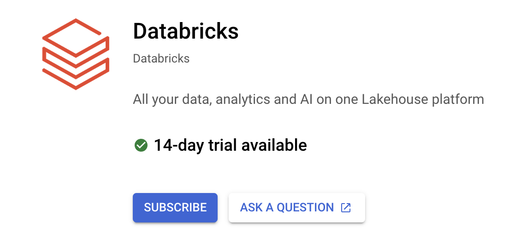
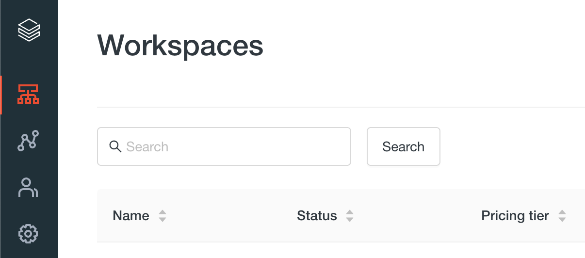
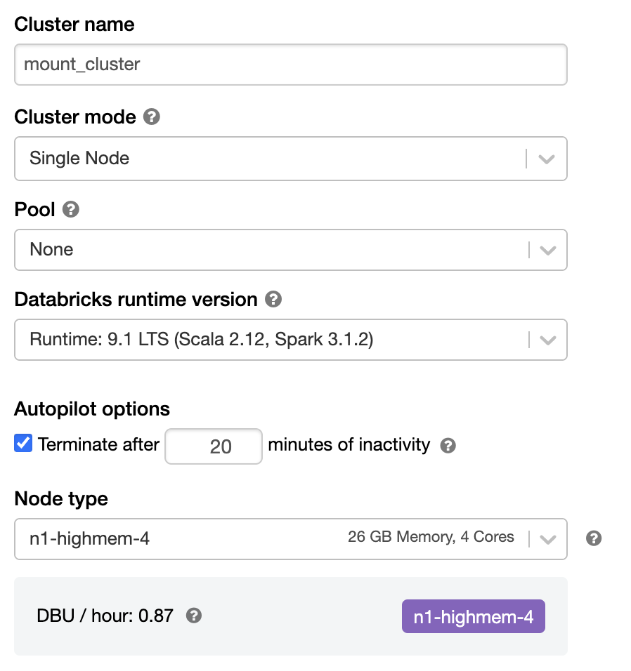
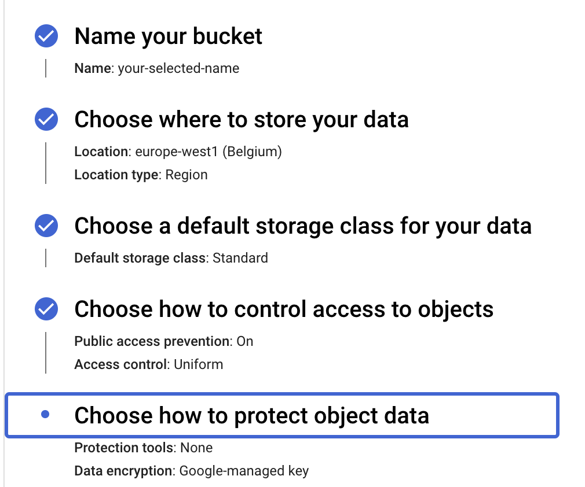
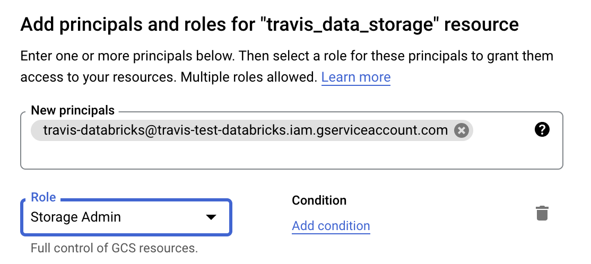
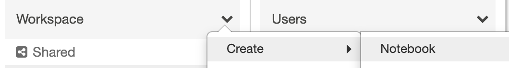
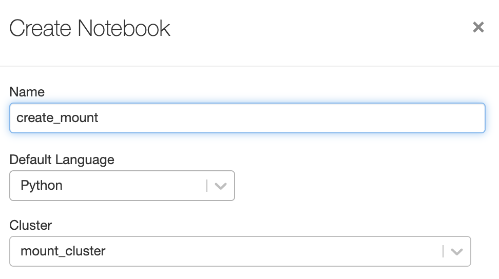

# Setting up Databricks in GCP

# Requirements

- You must have a [Google billing account](https://cloud.google.com/billing/docs/how-to/manage-billing-account).
- You must have the following roles for [Google Identity and Access Management (IAM)](https://cloud.google.com/iam/docs):
  - [Billing Administrator](https://cloud.google.com/billing/docs/how-to/billing-access#overview-of-cloud-billing-roles-in-cloud-iam) (`roles/billing.admin`) for the target Cloud Billing account *or* the Google Cloud organisation where your project is located.
  - [Viewer](https://cloud.google.com/resource-manager/docs/access-control-proj#using_basic_roles) (`roles/viewer`) for the project associated with the billing account you plan to use .
- You will need a Project connected to a valid Billing Account


# Enabling Databricks In GCP

1. In the [Google Cloud Console](https://console.cloud.google.com/) dashboard, type Databricks in the search bar and select it

2. Select the "Subscribe" button

   

3. Provided you have the correct Billing rights you will be directed to a screen to register with Databricks.

4. You should then be directed to sign in via Google SSO

5. Returning to the cloud console you should now see an option "Manage on Provider", select this

6. You will be redirected to an authentication screen followed by the Databricks Account Console

   

7. Select to create a new Workspace.

8. Fill in:

   1. The name of the workspace
   2. Your region
   3. A Project ID - this can be obtained in the Google Cloud Console in the Project Dashboard

9. A Databricks workspace will be provisioned.  The infrastructure will be setup in GCP and can be accessed in the project as follows:
   1. For storage, two Cloud Storage buckets will be created and can be found by select "Cloud Storage" in the Navigation Menu:
      1. system storage: This stores system data such as notebook revisions, job run details, command results, and Spark logs
      2. root storage: your workspace’s root storage for the [Databricks File System (DBFS)](https://docs.gcp.databricks.com/data/databricks-file-system.html).
   2. For compute, a Google Kubernetes Engine (GKE) cluster is provisioned.  This can be found by selecting "Kubernetes Engine" in the Navigation Menu.  More details on the use of GKE can be found [here](https://databricks.com/blog/2021/08/06/how-we-built-databricks-on-google-kubernetes-engine-gke.html)

10. The workspace can be accessed by selecting the workspace in the Workspaces overview and selecting the corresponding link.


For more details on enabling Databricks in GCP see the [Databricks documentation](https://docs.gcp.databricks.com/getting-started/try-databricks-gcp.html#requirements)

# Adding Users

## Admins

Additional Admins can be created in Databricks Account Console by selecting "Users & Groups" from the side bar and selecting to add a new user.  Users are added via an email invite.

## Workspace Users

Within a Databricks Workspace, users can be added by someone with Admin rights.  To add a user select "Settings" -> "Admin Console" -> "Users" and select to add a user.  This will also make use of an email invite.

# Creating a Cluster

In your Databricks Workspace, select "Compute" from the side menu.  Select "Create Cluster".  Clusters can be configured for many different use cases but for the context of this workshop, set the following:

- Cluster name: mount_cluster
- Cluster mode: Single Node
- Terminate after: 20 minutes



Select to create the cluster.

# Accessing a bucket through DBFS

This provides the means to store and load data outside of the provisioned storage for Databricks and is recommended for Production data.

## The Steps - High Level

1. Set up a Google Cloud service account
2. Configure your GCS bucket
3. Link the service account to your cluster
4. Mount the bucket


## 1. Set up a Google Cloud service account

Open the [Google Cloud Console](https://console.cloud.google.com/), ensure the correct Project is selected and select to open the cloud shell using the option in the top right:


In the Google Cloud shell within the context of your project run:

```sh
gcloud iam service-accounts create <service account id> --display-name="<Display Name>"
```

- `<service account id>` - your chosen id for your service account
- `<Display Name>` - your chosen display name for your service account

Still in the cloud shell, list the service accounts and note down the associated email

```sh
gcloud iam service-accounts list
```

A demo email: `travis-databricks@travis-test-databricks.iam.gserviceaccount.com`

You can also find it by selecting "IAM & Admin" -> "Service Accounts" from the Navigation Menu and then selecting the relevant account.

## 2. Configure the GCS bucket

Head to Cloud Storage in the Console and select "CREATE BUCKET"

Fill in the form with your select name as below, note that the name cannot contain an underscore (`_`)



> Note that the individual settings should be assessed for your particular storage needs, for instance the use of Access Control for finer grained permissions

In the newly created bucket details, select "PERMISSIONS" and select "ADD".  Fill in the service account email from Step 1 and set to the role to `Storage Admin`



## 3. Link the service account to a cluster

Select to Edit an existing cluster as outlined in the instructions above and open Advanced options. Set the Google Service Account field to your service account email address.

> The same can be set during creation of a new cluster

## 4. Mount the bucket

Create a new Notebook:

- Select "Workspace" from the sidebar

- Select the drop-down -> Create -> Notebook

  

- Fill a name for the notebook and ensure it is connected to the previously configured cluster

  

In the cell at the top of the notebook add the following code, filling in the name values

```python
bucket_name = "<bucket-name>"
mount_name = "<mount-name>"
dbutils.fs.mount(f"gs://{bucket_name}", f"/mnt/{mount_name}")
```

- bucket-name: The name of your bucket
- mount-name: The name to give your mount

Once filled in, run the cell by selecting "Shift+Enter" or selecting the Run icon -> "Run cell".  You can list the contents of the bucket using:

```python
dbutils.fs.ls(f"/mnt/{mount_name}")
```

And remove the mount using:

```python
dbutils.fs.unmount(f"/mnt/{mount_name}")
```


There are other options for connecting to Google Cloud Storage as documented [here](https://docs.gcp.databricks.com/data/data-sources/google/gcs.html#google-cloud-storage)

# Create and use Delta Tables

As a bonus, here are the steps to convert a CSV file into a Delta Table:

```python
from pyspark.sql import functions as F

# Load the red wine CSV, inferring the schema
wine_red = spark.read.option("Header",True).option("delimiter",";") \
.option("inferSchema",True) \
.csv('/databricks-datasets/wine-quality/winequality-red.csv')

# Adjust the column headers
wine_red = wine_red.select([F.col(col).alias(col.replace(' ', '_')) for col in wine_red.columns])

table_path = "dbfs:/shared/wine_data"
table_name = "wine_red"
database_name = "wine"

# Output to delta
wine_red.write.mode("overwrite").save(table_path)

# Create a database
spark.sql(f"CREATE DATABASE IF NOT EXISTS {database_name}")

# Create a table
spark.sql(f"CREATE TABLE IF NOT EXISTS {database_name}.{table_name} USING DELTA LOCATION '{table_path}'")
```