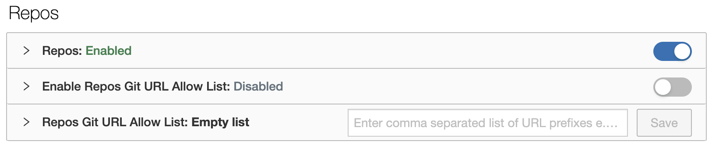
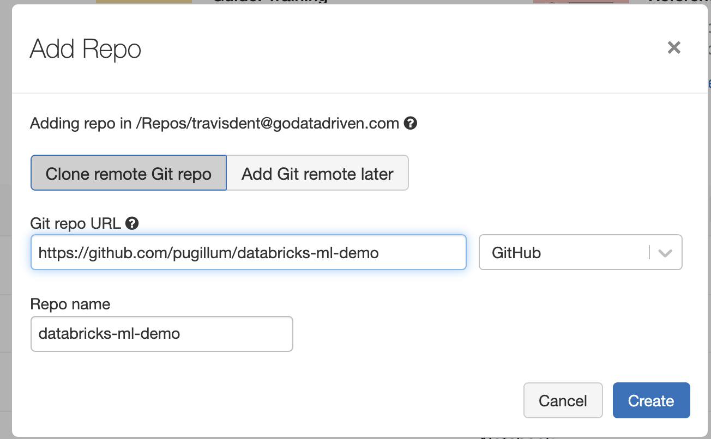
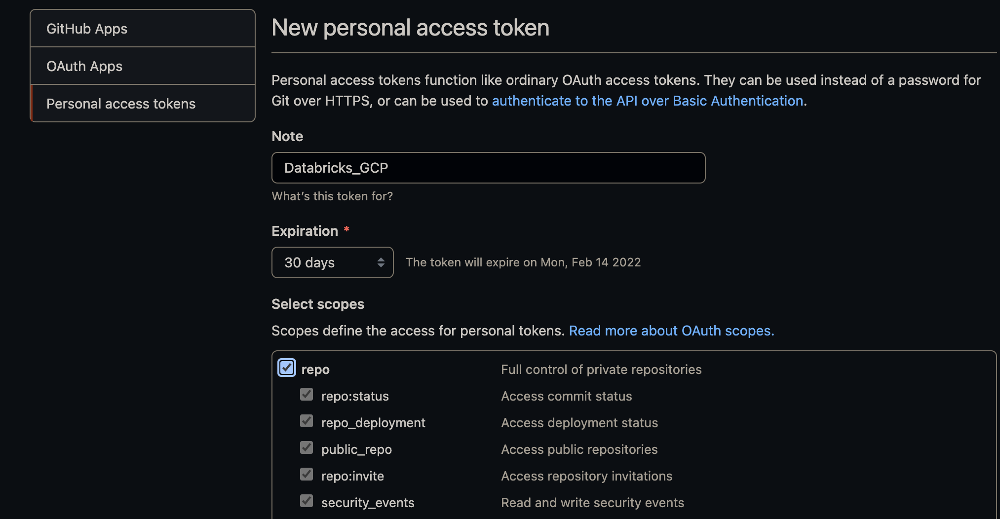
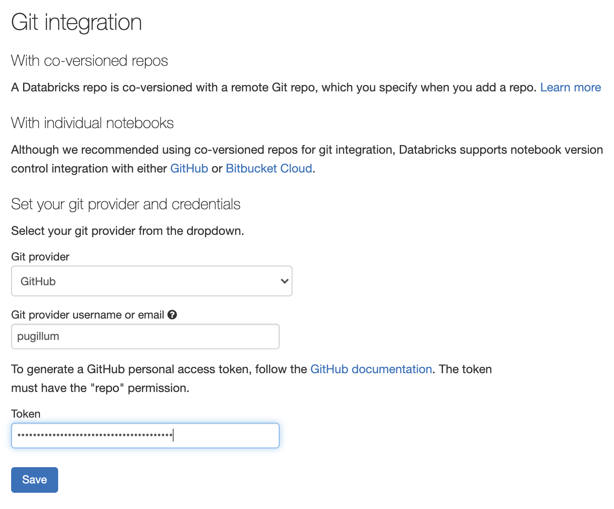
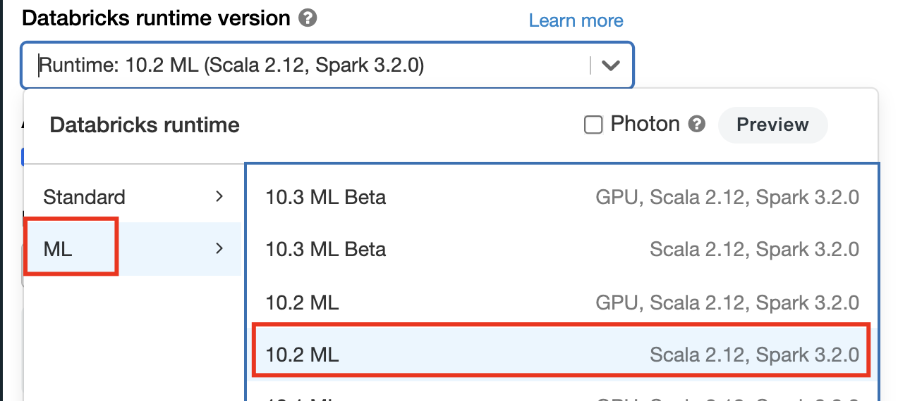
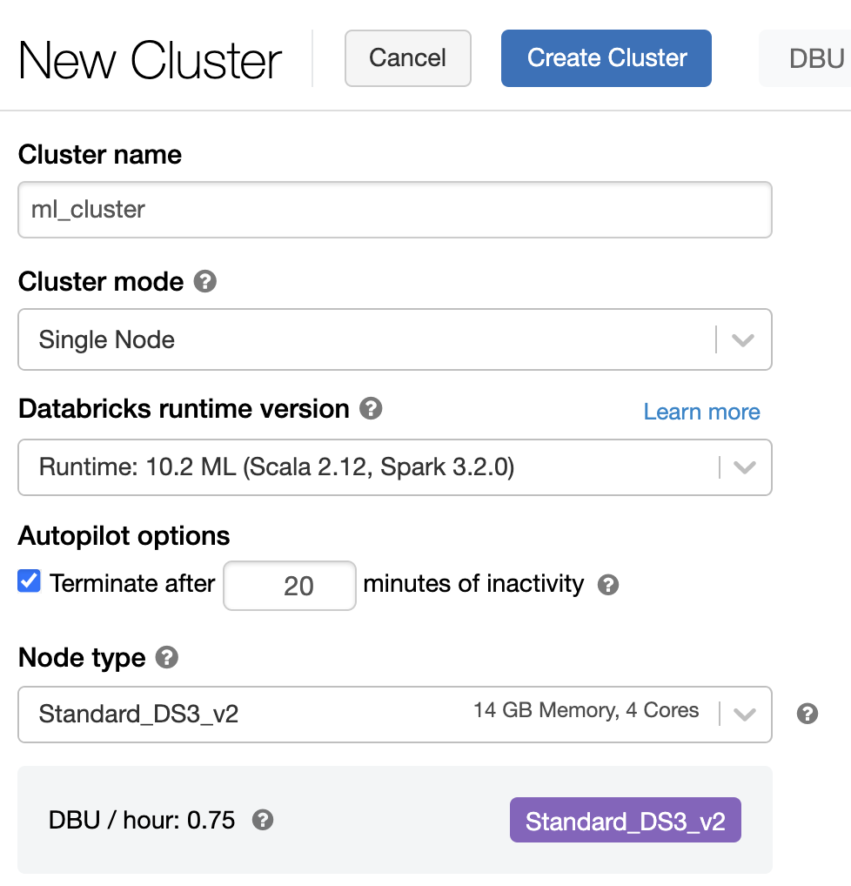

# Machine Learning in Databricks

For this part of the Training Taster we will be going through an end-to-end machine learning example to showcase the use of a few features for machine learning projects, namely:
- Repositories
- Experiments
- Model Registry

We will be working through the `mlops_example` notebook found in the `notebooks` folder of this repository.

# Linking to the repository

Though it is possible to import notebooks directly into one's workspace, Databricks supports direct integration of a git repo.  These instructions show how to do so for a public Github repository.

1. Go to Admin console and ensure that Repos is `Enabled` (_Note that is requires having Admin privileges_)
   
2. Refresh the page
2. Select Repos from the sidebar, select "Add Repo" and fill in the URL of this training Github repo.

	

6. Create

## Linking private repositories

The example above is for a public repository and will not allow pushing new changes.  To support linking to a private repository in Github you will need to make use of a Personal Access Token (PAT):

1. In Github go to developer settings -> Personal Access Tokens and create a new one that has the check next to repo.  Keep this token handy.
      

2. In Databricks workspace, go to User Settings and select "Git Integration"

3. Fill in the details to allow authentication with Github:
    

> Note: In AWS and Azure it is possible to access more than notebooks via the Repos feature.  This is not yet supported in GCP.

# Create an ML Cluster

The ML Clusters are provisioned with additional libraries for machine learning needs.  To complete this exercise you will need to create one:

1. Select Compute from the side menu

2. Make sure to select an ML Cluster

   

3. For completing this exercise, these settings should suffice

   

4. Select "Create Cluster"

# An end-to-end ML example

The notebook used is based on [this](https://docs.databricks.com/_static/notebooks/mlflow/mlflow-end-to-end-example.html) notebook from Databricks with some adjustments.  Once you have linked the Github repository you'll be able to walk through the notebook.

