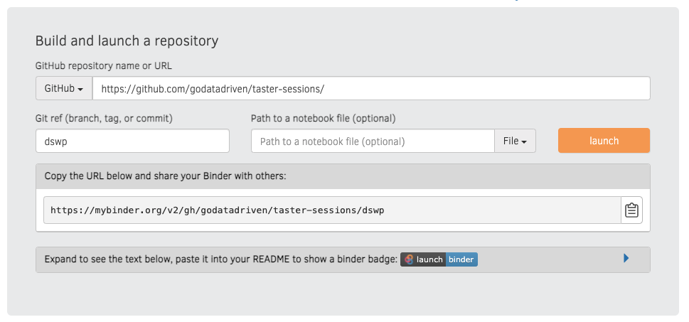

# GDD Training Taster Sessions

## Introduction

This repository contains all notebooks and materials for each GDD Training Taster.

Each taster is run for our public courses. To access the material for the course you can go to the branch corresponding to the taster. Here is a breakdown of the branch names:

|Branch Name|Taster Name|Description|
|---|---|---|
|pfda|Python for Data Analysts|Covers Python Essentials and Pandas with some visualisations to demonstrate the power of Python|
|dswp|Data Science with Python|An introduction to Machine Learning followed by a demo of using sci-kit learn on the penguins dataset|
|adwsp|Advanced Data Science with Python|An introduction to all topics covered in the ADWSP course followed by demo of feature engineering|

## Contributing

To add a new taster you can use the taster-template branch and add all the notebooks/files you need. Feel free to remove folders that aren't necessary.

### Using Binder

Each course corresponds to a Binder link (redirected with rebrandley) for participants to use during the training.

To create a binder link for a taster, first create a `requirements.txt` file with all the packages needed for the taster. Then visit [Binder](https://mybinder.org/), paste the URL of this repo and include the name of the branch when creating:

## Contacts

Please reach out to the data science training team - Lucy Sheppard, James Hayward, Marysia Winkels - if you have any questions.
