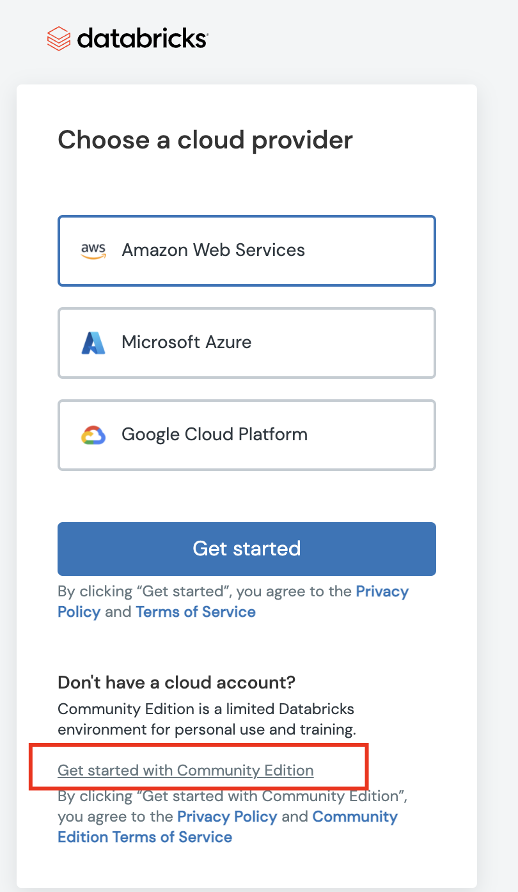

# Machine Learning with Databricks on GCP Taster Session - GDD

## Introduction

This repository contains all materials for the Taster.  The steps followed by the taster are covered in the markdown files and Databricks notebook

## Requirements

### Databricks in GCP

To complete the setup of Databricks in Google Cloud Platform will require having a [Cloud Billing Account](https://cloud.google.com/billing/docs/how-to/manage-billing-account).

### Machine Learning with Databricks

This can be followed in all cloud versions (GCP/AWS/Azure) of Databricks.  There is also a Community Edition which provides MLFlow tracking but no model registry. This can setup as follows:

1. Fill in your details (with a valid email address) on [this](https://databricks.com/try-databricks) page.

2. In the pop-up select the Community Edition

  

3. You will be emailed a link.  When opened you will be redirected to completion of the account setup.

## Sessions

This repository has been developed for the [Machine Learning with Databricks on GCP Taster Session](https://binx.io/topic/training-tasters-2022/#databricks) on 2 February 2022.

